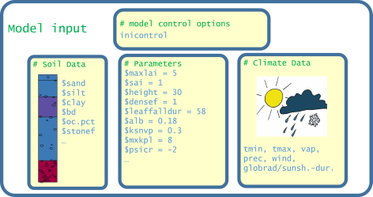
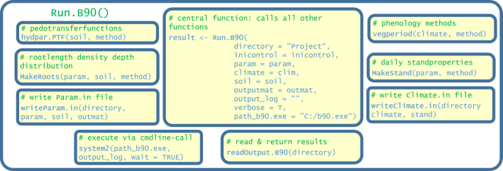

This vignette gives a brief introduction to the usage of the *brook90r* *R* package. The package serves as an interface between *R* and the executable code of the hydrological model LWF-BROOK90 [@hammel_charakterisierung_2001]. The executable file *b90.exe* is available at the Bavarian State Institute of Forestry. The package provides special functions for writing input files from model control options, parameters, and meteorological data, executes the model code and returns the contents of the output files generated by the model code. The functionnality is presented on a working example

***

#Introduction

Brook90r
LWF-BROOK90 [@hammel_charakterisierung_2001] to derive the basic data for the NFIWADS database. The model simulates daily evapotranspiration and soil water fluxes, along with soil water contents and pressure heads of a soil profile covered with vegetation. It is a modified version of the original BROOK90 hydrological model (Federer 2002; Federer et al. 2003). Both versions have demonstrated their potential in many studies (Armbruster et al. 2004; Schwärzel et al. 2009; Baumgarten et al. 2014; Vilhar 2016). The main differences of LWF-BROOK90 compared to the original model version are the description of soil hydraulic properties and the option to use interannual and intraannual dynamic vegetation characteristics along with the climate data. Soil hydraulic functions were parameterized using the expressions of van Genuchten (1980) and Mualem (1976). The soil profile is represented by multiple layers, through which the vertical water movement is described according to Darcy’s law and the continuity equation (Richards 1931), taking root water uptake and macropore-assisted infiltration into account. The lower boundary of the profile is defined as unit gradient gravitational water flow from the lowest soil layer. Groundwater inflow and interflow at sloped sites is not accounted for. Evapotranspiration is estimated using the approach of Shuttleworth and Wallace (1985), modified to differentiate day-time and night-time evapotranspiration. The method is based on the Penman-Monteith equation (Monteith 1965) and separately estimates the vapour fluxes originating from a “single big leaf” plant layer (transpiration and interception evaporation) and the ground surface (soil and snow evaporation), using a water vapour conductivity model. An important controlling variable is the leaf area index, which is used to partition available energy between plant and soil according to Beer’s law, to determine rainfall interception storage capacity and catch rates, and to scale stomatal conductance to the canopy level. Stomatal conductance is calculated from maximum leaf conductance, which is reduced for unfavorable temperature, vapour pressure deficit, and global radiation following the model of Jarvis (1976). The calculated water demand of the canopy (potential transpiration) is covered by a water supply rate (actual transpiration) that depends on plant conductivity and the soil layers’ individual water availability and root length density, and is lower than potential transpiration if water availability in the rooting zone is limited.
